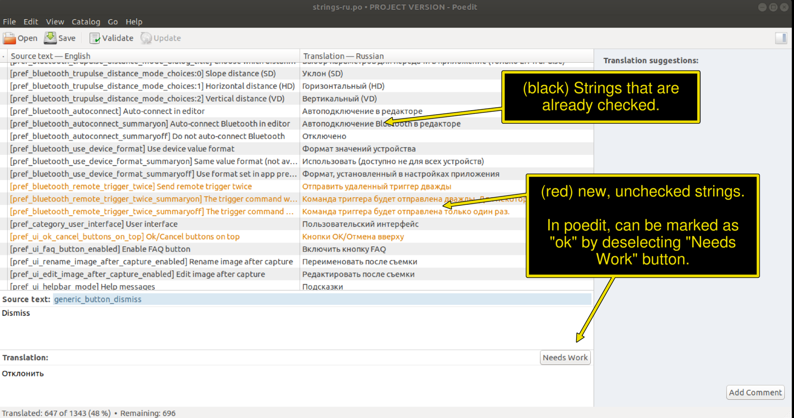

# ImageMeter-translations

Translation files for the ImageMeter software (https://play.google.com/store/apps/details?id=de.dirkfarin.imagemeter).

Feel free to add missing translations, add new languages, or fix errors.

The translations are organized in three directories.
The directory `core` contains strings that are shared between all variants of the software.
The directories `android` and `desktop` contain the strings that are specific to the Android version and the Windows/Linux PC versions, respectively.

When adding new languages, you can start with the `strings.pot` template file.
An easy and free software for editing PO files is `poedit` (https://poedit.net/), but you can use whatever you like, even a plain text editor.

Since new strings are added continuously, I often fill the gaps with automatic translated strings.
However, all automatic translations are marked as `fuzzy` (Needs work). Hence, when looking at the file as a translator,
you should primarily check the `fuzzy` strings and remove that mark when the string is ok or you provided a better translation.

Thank you for your help !
